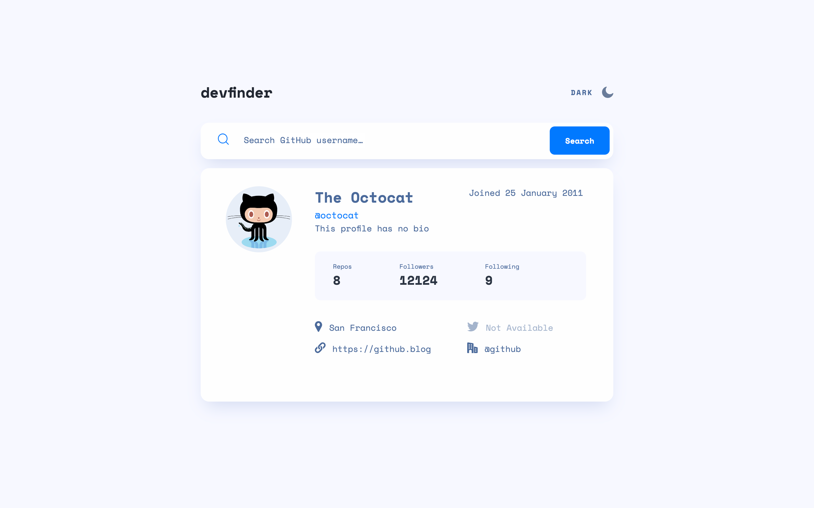

# Frontend Mentor - GitHub user search app solution

This is a solution to the [GitHub user search app challenge on Frontend Mentor](https://www.frontendmentor.io/challenges/github-user-search-app-Q09YOgaH6). Frontend Mentor challenges help you improve your coding skills by building realistic projects. 

## Table of contents

- [Overview](#overview)
  - [The challenge](#the-challenge)
  - [Screenshot](#screenshot)
  - [Links](#links)
- [My process](#my-process)
  - [Built with](#built-with)
  - [What I learned](#what-i-learned)
  - [Useful resources](#useful-resources)
- [Author](#author)


## Overview

### The challenge

Users should be able to:

- View the optimal layout for the app depending on their device's screen size
- See hover states for all interactive elements on the page
- Search for GitHub users by their username
- See relevant user information based on their search
- Switch between light and dark themes
- **Bonus**: Have the correct color scheme chosen for them based on their computer preferences. _Hint_: Research `prefers-color-scheme` in CSS.

### Screenshot



### Links

- Solution URL: (https://github.com/Chenxi96/githubUserSearchApp)
- Live Site URL: (https://whimsical-kashata-45f4e5.netlify.app)

## My process

### Built with

- Semantic HTML5 markup
- CSS custom properties
- Flexbox
- Mobile-first workflow
- [React](https://reactjs.org/) - JS library


### What I learned

I learned how to use react jsx to add light and dark mode to altrenate the modes.

To see how you can add code snippets, see below:

```js
      <header>
        <h1 className={`${mode}`}>devfinder</h1>
        <div onClick={lightDarkMode} className={`light-mode ${mode}`}>
          <p className={`${mode}`}>{mode === 'dark-mode' ? 'LIGHT' : 'DARK'}</p>
          {mode === 'lightMode' ? <Moon className={mode} alt="" width={20} height={20} /> : <Sun className={mode} alt="" width={20} height={20} /> }
        </div>
      </header>
```
```scss

// dark mode
.dark-mode-body {
    background-color: $darkMblack;
}

.dark-mode {
    color: $darkMWhite;
    user-select: none;
}

.dark-mode g {
    fill: $darkMWhite;
}

.dark-mode:hover {
    color: #90A4D4;
    cursor: pointer;
    g {
        fill: #90A4D4;
    };
    p {
        color: #90A4D4;
    }
}


.dark-mode-input {
    background-color: $darkMDarkBlue;
    box-shadow: none;
}

.dark-mode-input input {
    background-color: $darkMDarkBlue;
    color: $darkMWhite;
}

.dark-mode-input input::placeholder {
    color: $darkMWhite;
}

// light mode

.lightMode > p {
    color: $lightMGrayBlue;
}

.lightMode:hover {
    cursor: pointer;
    color: #222731;
    filter: brightness(0%);
}
```

### Useful resources

- [toggle light and dark mode](https://www.w3schools.com/howto/howto_js_toggle_dark_mode.asp) - Even though this is just the basic javascript it got me thinking on how I can create one for React.


## Author

- Website - [Chenxi](https://my-portfolio-vert-xi-14.vercel.app/)
- Frontend Mentor - [@Chenxi96](https://www.frontendmentor.io/profile/Chenxi96)
- Twitter - [@Chenxi_Lin_](https://www.twitter.com/Chenxi_Lin_)


